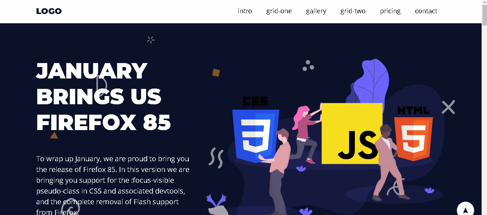

<html>
<h1>MY_GRID</h1>

<a>O que esse projeto me ajudou a prender foi que o css é a parte de reestilização,
conseguir aplicar tudo que eu aprender.
</a>

<li>Olha o resultado do projeto.

E conseguir aprender o HTML é aplicar no projeto .

<html>